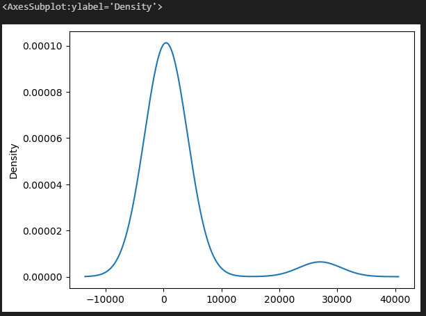
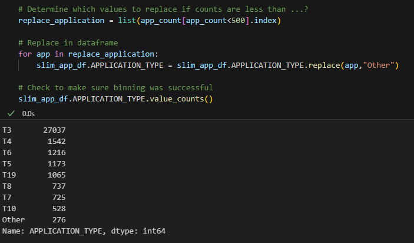
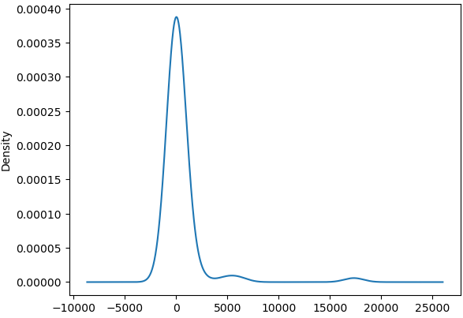
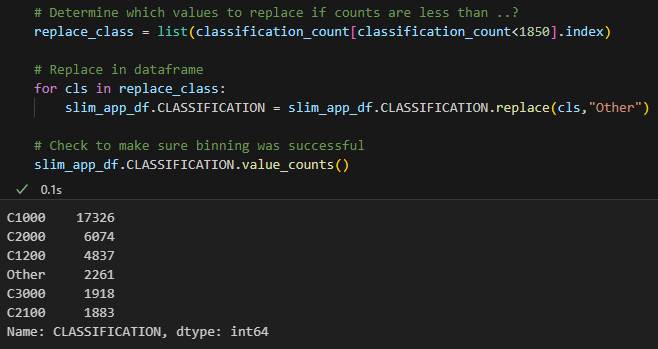
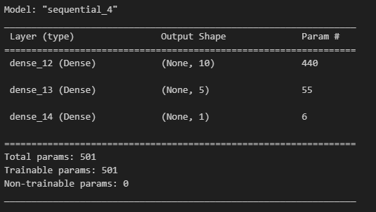
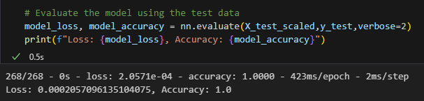

# Neural Network Charity Analysis

## Overview
The purpose of this analysis is to use the features in the provided dataset to create a Neural Network to help us predict whether applicants will be successful if the Alphabet Soup funds them. Alphabet Soup provided a CSV that contained more than 34,000 organizations that received funding from Alphabet Soup over the years. 

## Results

### Preprocessing
The first that needed to be done with this data was to preprocess everything and ensure it would function with a machine learning Neural Network model. As with previous machine learning models, for a neural network to function, all of the data would need to be transformed into binary classifiers. The following steps would need to be considered: 
* The target variable will be the STATUS column.
* We will remove the EIN and NAME columns as these both will not be targets or features.
* The features will be the the rest of the data in the other columns.

In order for us to receive accurate results and refrain from overfitting or underfitting, we will need to bin some variables inside of columns that have many too many values. The ideal number of values per columns is 10 or less. 

#### Binning columns
During the research process, I could determine that there were too columns that needed to be binned; the APPLICATION_TYPE and CLASSIFICATION columns. Once we plot the density of the APPLICATION_TYPE we can determine where the cutoff should be: 


* Based off this density graph, the cutoff should be less than 500. This now gives us 9 variables: 


The same density was reviewed in the CLASSIFICATION column: 


* Based off this density graph, the cutoff should be less than 1850. This now gives us 6 variables: 


### Compiling, Training, and Evaluating the Model

The nest step consisted of encoding the remaining data into a binary format and merging the DataFrames. Once everything was merged, the feature and target arrays were created and scaled.
```
# Split our preprocessed data into our features and target arrays
y = slim_app_df["STATUS"].values
X = slim_app_df.drop(["STATUS"],1).values
```
```
# Create a StandardScaler instances
scaler = StandardScaler()

# Fit the StandardScaler
X_scaler = scaler.fit(X_train)

# Scale the data
X_train_scaled = X_scaler.transform(X_train)
X_test_scaled = X_scaler.transform(X_test)
```
from this model, the following was completed: 
* A total of 10 neurons were selected for the first layer with a "relu" activation.
* A second layer with 5 neurons were selected with the same "relu" activation. 
* Output layer was selected as "sigmoid"
* Total parameters shows 501

The model summery shows: 


Testing the accuracy of this Neural Network gives us really good results: 


## Summary
Because we were able to attain such an accurate score on our first iteration, model optimization was not recommended for this Neural Network. I was able to achieve 100% accuracy with a Loss total of less than .02%. I was able to achieve the recommended accuracy of 75% without the need to create more neurons and adding hidden layers. Adding such variables would create overfitting of the model. A RandomForest model would also appear to accurately predict the same results. This model would take less effort and may be less intensive compared to the deep learning neural network model that we achieved here. There may also be too many columns from the original CSV, that we may remove as well.

